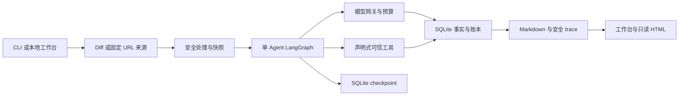

# Code Review Agent 公开架构说明

> **关联 MR**:
> - 待确认：GitHub 初次发布，当前无 PR。

## TL;DR

项目使用 Python、单 Agent LangGraph 与 SQLite，把输入安全处理、模型与工具调用、预算、恢复决策和报告串联。本地工作台和 CLI 复用同一个审阅核心；S2 prompt 与严格证据校验保持冻结。业务库保存事实，checkpoint 保存进度引用，恢复不会重置调用或费用。工具由可信实现和声明组成，只能读取安全 diff 快照。

## 数据流与可观测性

以下流程中，原始 diff 在进入图与任务数据库前先完成安全处理。网页是输入／观察适配器，展示已提交事实，不决定账本结算。

模型请求先冻结 PreparedProviderRequest，归档、quote 与发送使用同一内容，认证只在传输层加入。工具返回与后续模型请求关联，评论通过锚点、支持证据和契约证据追溯；锚点与支持证据不是同一概念。工作台状态时间为观察时间，缺失事件保持缺失。

## 调用、预算与故障语义

一个 operation 可以有多个 attempt，每个 attempt 最多发送、预留和结算一次。RESERVED 可沿用原预留恢复；只有 DISPATCHED 事务提交后才允许发送。DISPATCHED 后结果不明记为 UNKNOWN，保持 HELD，不自动重发或释放。

完整收到但格式无效的安全回复仍持久化，usage 完整就结算，不能因为结果不可用免费重跑。REPAIR 是绑定具体轮次错误结果的独立 operation，默认每单元最多一次。人工重试的 decision 与新 attempt、预留同事务绑定，重放不能重复消费；新 attempt 再次 UNKNOWN 需新选择。

任务 token／金额预算包括 REVIEW、后续轮次、REPAIR 和 HELD；实际超 quote 的停发标记跨单元和 resume 生效。使用版本化价格，峰时、全输入 cache-miss 和完整输出上限保守预留；旧价格任务需要新发送时阻断。历史费用通过追加复核表达，不覆盖旧价格、账本或 artifact。它仍是本地估算，不等于提供方账单。

## 工具与来源边界

工具注册器校验唯一名称、版本、handler_id、输入输出 schema、权限、超时和输出上限，并冻结实现与运行器摘要。新增工具需将可信实现和声明加入宿主拥有的目录，无需修改 Agent 主流程；模型与目标仓库不能指定任意可执行代码。超时和输出上限在执行过程中生效，输出截断保留已完整到达的安全记录。

URL 来源限定 github.com／gitlab.com，冻结 head 与比较基准，保存安全来源及覆盖清单。排除文件属于显式范围限制；缺失 patch 是来源信息不完整，不能当作已审阅。连接约束、恢复边界与来源一致性有 mock 测试，GitLab 真实获取及完整在线审阅链路仍未覆盖。

## 实现入口

[app.py](../../src/review_agent/app.py) 连接输入、核心与恢复；[storage.py](../../src/review_agent/storage.py) 保存调用事实与账本；[gateway.py](../../src/review_agent/gateway.py) 管理发送边界；[工具模块](../../src/review_agent/tools/) 管理可信扩展与限制。[工作台](../../src/review_agent/workbench/) 提供本地 API 设置、输入、分组任务历史及观察；网页凭证仅保留内存，重启需重新输入。

[进程恢复测试](../../tests/test_process_recovery.py)、[截断测试](../../tests/test_tool_output_limit.py)、[工作台测试](../../tests/test_workbench.py)覆盖关键边界；[README](../../README.md)提供可执行命令及完整已知限制。
